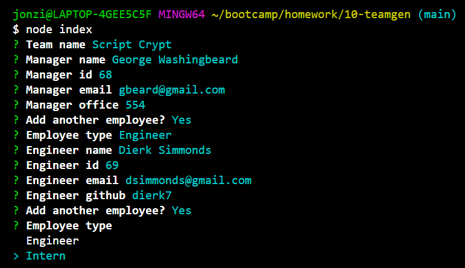

# Command Line HTML Generator
## Description
This project allows for the quick creation of an html page that organizes information for a team of developers.

## Video Link
https://drive.google.com/file/d/1kOTVLSGIWm-kVAersZN4pSy7-2IM-QIT/view

## Table of Contents
- [Installation](#installation)
- [Usage](#usage)
- [Credits](#credits)
- [License](#license)

## Installation
Ensure that <a href='https://nodejs.org/en/download/'>node</a> is installed on your local machine, and then clone this repo to your local repository: git@github.com:Glitch0320/10-teamgen.git.

## Usage
On the command line, navigate to the root folder of index.js, and run node index. Answer each prompt and your file will be created.

## Screenshot

## Credits

### Collaborators
https://github.com/Glitch0320/

### Third Party Attribution
N/A

### Resources
N/A

## License
Liscense under the MIT liscense.

## Features
Build a responsive html page by answering a few questions.

## How to Contribute
N/A

## Tests
In the root folder, enter the command npm run test.

## Questions
Contact me by email: glitch0320@gmail.com

---